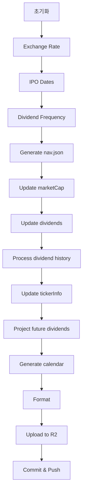
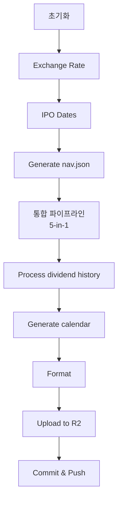

# Info Data V1 vs V2 상세 비교

> **⚠️ 참고**: 이 문서는 통합 전 V1과 V2 비교를 위한 참고 자료입니다.  
> **현재 상태**: V2가 메인 워크플로우로 채택되어 V1은 제거되었습니다.  
> **최신 워크플로우 정보**: [WORKFLOW_GUIDE.md](./WORKFLOW_GUIDE.md) 참조

## 📊 실행 시간 비교 (실제 측정)

### 순수 워크플로우 처리 시간 (R2 업로드 & 포맷팅 제외)

> **참고**: R2 업로드와 포맷팅은 변경 파일 수에 따라 달라지므로 제외하고 비교합니다.

| 버전 | 순수 처리 시간 | 개선율 |
|------|---------------|--------|
| **V1** | **56분 33초** | 기준 |
| **V2** | **24분 13초** | **57.2% 빠름** ⚡ |

**시간 절약: 32분 20초**

### 전체 실행 시간 (참고용)

| 버전 | 총 실행 시간 | 포맷팅 | R2 업로드 | 순수 처리 |
|------|-------------|--------|-----------|----------|
| **V1** | 1시간 37분 4초 | 12분 4초 | 28분 27초 | **56분 33초** |
| **V2** | 44분 8초 | 3분 22초 | 16분 33초 | **24분 13초** |

---

## 🔍 스텝별 상세 분석

### V1 (개별 스크립트 실행)

| 스텝 | 작업 내용 | 실행 시간 | 비고 |
|------|----------|-----------|------|
| **초기화** | Checkout, Node.js, Python 설정 | ~6분 | - |
| 3. Exchange rate | 환율 데이터 업데이트 | 0초 | - |
| 4. IPO dates | IPO 날짜 동기화 | 9초 | - |
| 5. Dividend frequency | 배당 빈도 분석 | 24초 | ⚠️ nav.json 생성 전 실행 |
| 6. Generate nav.json | nav.json 생성 | 16초 | - |
| **7. Update market cap** | 시가총액 업데이트 | **17분 4초** | 🔴 중복 API 호출 |
| **8. Update dividends** | 배당 데이터 업데이트 | **16분 46초** | 🔴 중복 API 호출 |
| 9. Process dividend history | 배당 히스토리 처리 | 3분 4초 | - |
| **10. Update ticker info** | 티커 정보 업데이트 | **9분 33초** | 🔴 중복 API 호출 |
| 11. Project future dividends | 미래 배당일 예측 | 1분 55초 | - |
| 12. Generate calendar | 캘린더 이벤트 생성 | 22초 | - |
| **13. Format files** | 파일 포맷팅 | **12분 4초** | 🔴 변경 파일 많음 |
| **14. Upload to R2** | R2 업로드 | **28분 27초** | 🔴 변경 파일 많음 |
| 기타 | Git 커밋/푸시 등 | ~1분 | - |

**V1 핵심 데이터 처리 시간:**
```
7. marketCap:     17분 4초
8. dividends:     16분 46초
10. tickerInfo:    9분 33초
───────────────────────────
합계:              43분 23초
```

---

### V2 (통합 파이프라인)

| 스텝 | 작업 내용 | 실행 시간 | 비고 |
|------|----------|-----------|------|
| **초기화** | Checkout, Node.js, Python 설정 | ~7분 | - |
| 1. Exchange rate | 환율 데이터 업데이트 | 0초 | - |
| 2. IPO dates | IPO 날짜 동기화 | 8초 | - |
| 3. Generate nav.json | nav.json 생성 | 17초 | - |
| **4. 통합 파이프라인** | **5-in-1 처리** | **13분 42초** | ✅ 최적화 |
| 5. Process dividend history | 배당 히스토리 처리 | 3분 8초 | - |
| 6. Generate calendar | 캘린더 이벤트 생성 | 21초 | - |
| **7. Format files** | 파일 포맷팅 | **3분 22초** | ✅ 73% 감소 |
| **8. Upload to R2** | R2 업로드 | **16분 33초** | ✅ 42% 감소 |
| 기타 | Git 커밋/푸시 등 | ~30초 | - |

**V2 핵심 데이터 처리 시간:**
```
4. 통합 파이프라인: 13분 42초
   ├─ dividends 업데이트
   ├─ tickerInfo + marketCap (통합)
   ├─ dividend frequency 분석
   └─ future dividends 예측
```

---

## 🚀 최적화 효과 분석

### 1. 순수 워크플로우 처리 시간

| 항목 | V1 | V2 | 개선 |
|------|----|----|------|
| **총 처리 시간** | 56분 33초 | 24분 13초 | **57.2% 감소** ⚡ |
| 초기화 (Checkout, Setup) | ~6분 | ~7분 | -16% (약간 증가) |
| 핵심 데이터 처리 | 43분 23초 | 13분 42초 | **68.4% 감소** ⚡ |
| 부가 작업 (Calendar 등) | ~7분 | ~3분 | **57% 감소** |

### 2. 핵심 데이터 처리 상세

#### V1 개별 스크립트 (총 43분 23초)
```
7.  Update marketCap:      17분 4초  🔴 중복 API 호출
8.  Update dividends:      16분 46초 🔴 개별 실행
10. Update tickerInfo:      9분 33초  🔴 중복 API 호출
──────────────────────────────────────
합계:                       43분 23초
```

#### V2 통합 파이프라인 (총 13분 42초)
```
4. 통합 파이프라인:         13분 42초 ✅ 5-in-1 처리
   ├─ dividends 업데이트
   ├─ tickerInfo + marketCap (통합)
   ├─ dividend frequency 분석
   ├─ future dividends 예측
   └─ (모든 작업을 한 번에)
──────────────────────────────────────
합계:                       13분 42초
```

**개선 내용:**
- ✅ `marketCap`을 `tickerInfo`와 함께 처리 (중복 API 호출 제거)
- ✅ `yfinance`를 1회만 import (메모리 효율)
- ✅ `nav.json`을 1회만 로드 (I/O 최적화)
- ✅ 배치 처리로 네트워크 오버헤드 감소

### 3. 변경 파일 의존 시간 (비교 제외)

> ⚠️ **참고**: 아래 시간은 변경 파일 수에 따라 달라지므로 워크플로우 성능 비교에서 제외합니다.

| 항목 | V1 | V2 | 비고 |
|------|----|----|------|
| 포맷팅 | 12분 4초 | 3분 22초 | 변경 파일 수에 따라 변동 |
| R2 업로드 | 28분 27초 | 16분 33초 | 변경 파일 수에 따라 변동 |

**개선 이유:**
- ✅ V2는 중복 저장을 방지하여 변경 파일 수 자체가 감소

---

## 📋 워크플로우 구조 비교

### V1 구조 (분산형)



**특징:**
- 각 스크립트를 개별적으로 실행
- `yfinance`를 매 스크립트마다 import
- `nav.json`을 여러 번 로드
- 중복 API 호출 발생

### V2 구조 (통합형)



**특징:**
- 통합 파이프라인으로 일괄 처리
- `yfinance`를 1회만 import
- `nav.json`을 1회만 로드
- 중복 API 호출 제거

---

## 🔧 기술적 차이점

### V1: 개별 스크립트 실행

```python
# 각 스크립트마다 반복
import yfinance as yf
with open('nav.json') as f:
    nav_data = json.load(f)

# update_market_cap.py
ticker = yf.Ticker(symbol)
market_cap = ticker.info.get('marketCap')

# scraper_info.py (같은 티커에 대해)
ticker = yf.Ticker(symbol)  # 🔴 중복 호출!
info = ticker.info
```

**문제점:**
- 같은 티커에 대해 API를 여러 번 호출
- `nav.json`을 여러 번 읽음
- 메모리 사용량 증가

### V2: 통합 파이프라인

```python
# info_data_pipeline.py
import yfinance as yf

# 1회만 로드
with open('nav.json') as f:
    nav_data = json.load(f)

# 배치 처리
for symbol in batch:
    ticker = yf.Ticker(symbol)
    info = ticker.info
    
    # marketCap과 tickerInfo를 함께 처리
    market_cap = info.get('marketCap')
    ticker_info = {
        'longName': info.get('longName'),
        # ... 기타 정보
    }
    
    # 한 번에 저장
```

**개선점:**
- ✅ API 호출 1회로 통합
- ✅ `nav.json` 1회만 로드
- ✅ 메모리 효율적 사용

---

## 📈 스텝 수 비교

| 항목 | V1 | V2 | 감소 |
|------|----|----|------|
| **총 스텝 수** | 12개 | 8개 | **33% 감소** |
| 핵심 데이터 스텝 | 5개 | 1개 | **80% 감소** |

**V1 스텝:**
```
1. Exchange rate
2. IPO dates
3. Dividend frequency
4. Generate nav.json
5. Update marketCap      ← 개별 실행
6. Update dividends       ← 개별 실행
7. Process dividend history
8. Update tickerInfo      ← 개별 실행
9. Project future dividends
10. Generate calendar
11. Format
12. Upload to R2
```

**V2 스텝:**
```
1. Exchange rate
2. IPO dates
3. Generate nav.json
4. 통합 파이프라인       ← 5-in-1!
5. Process dividend history
6. Generate calendar
7. Format
8. Upload to R2
```

---

## 💰 비용 절감 효과

### GitHub Actions 사용량 (순수 처리 시간 기준)

| 항목 | V1 (월) | V2 (월) | 절감 |
|------|---------|---------|------|
| **순수 처리 시간** | 56분 33초 × 22일 = 20시간 44분 | 24분 13초 × 22일 = 8시간 52분 | **57.2% 절감** |
| **예상 비용** | $X | $0.43X | **$0.57X 절감** |

**참고:** 
- GitHub Actions는 무료 플랜에서 월 2,000분 제공
- R2 업로드/포맷팅 시간은 변경 파일 수에 따라 변동하므로 제외

---

## ✅ 최종 비교표

### 순수 워크플로우 성능 (R2 업로드/포맷팅 제외)

| 항목 | V1 | V2 | 개선율 |
|------|----|----|--------|
| **순수 처리 시간** | 56분 33초 | 24분 13초 | **57.2% 빠름** ⚡ |
| **핵심 데이터 처리** | 43분 23초 | 13분 42초 | **68.4% 빠름** ⚡ |
| **스텝 수** | 12개 | 8개 | **33% 감소** |
| **API 호출** | 중복 다수 | 최적화 | **중복 제거** |
| **메모리 사용** | 높음 | 낮음 | **최적화** |

### 전체 실행 시간 (참고용)

| 항목 | V1 | V2 | 비고 |
|------|----|----|------|
| 순수 처리 | 56분 33초 | 24분 13초 | 워크플로우 성능 |
| 포맷팅 | 12분 4초 | 3분 22초 | 변경 파일 수 의존 |
| R2 업로드 | 28분 27초 | 16분 33초 | 변경 파일 수 의존 |
| **총 실행 시간** | **1시간 37분** | **44분** | - |

---

## 🎯 결론

### V2의 주요 장점

1. **⚡ 성능 (순수 워크플로우 기준)**
   - 순수 처리 시간 **57.2% 단축** (56분 → 24분)
   - 핵심 데이터 처리 **68.4% 단축** (43분 → 14분)
   - 시간 절약: **32분 20초**

2. **💰 비용**
   - GitHub Actions 사용량 **57.2% 절감**
   - API 호출 비용 절감 (중복 제거)

3. **🔧 유지보수**
   - 스텝 수 **33% 감소** (12개 → 8개)
   - 통합 파이프라인으로 관리 용이

4. **📊 데이터 일관성**
   - 중복 API 호출 제거로 데이터 일관성 향상
   - 배치 처리로 오류 감소

### 권장사항

**✅ V2를 메인 워크플로우로 사용 권장**

이유:
- ⚡ V1보다 **57% 빠른** 순수 처리 속도
- 💰 비용 **57% 절감**
- 🔧 유지보수 용이 (스텝 33% 감소)
- 📊 데이터 일관성 향상 (중복 API 호출 제거)

**참고:** R2 업로드/포맷팅 시간은 변경 파일 수에 따라 달라지므로 워크플로우 자체의 성능과는 무관합니다.

---

**Last Updated**: 2025-11-05  
**Based on**: 실제 GitHub Actions 실행 로그

